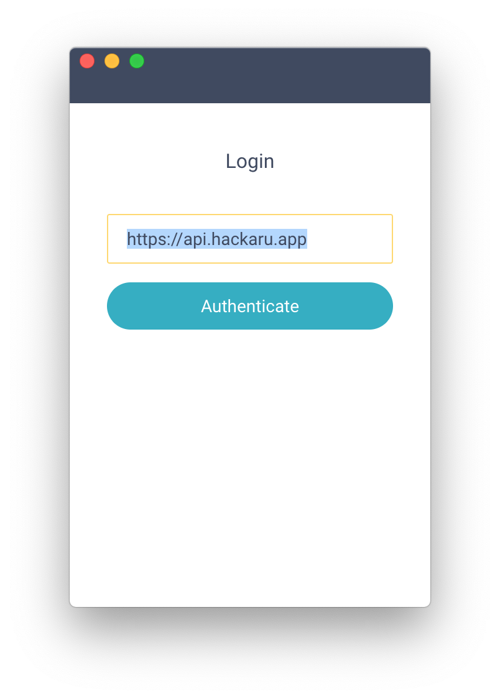

[English](./README.md) | [日本語](./README.ja.md)

---

# Hackaru Desktop

[](https://travis-ci.org/ktmouk/hackaru-desktop)

[Hackaru](https://github.com/ktmouk/hackaru) for Desktop.

## Feature

- This app is created using [Electron](https://github.com/electron/electron). Support Windows, macOS and Linux.
- Auto tracking support.
- Track your computer status. (e.g., When your notebook will be suspend, stop the timer.)
- Completely open source.

## Auto tracking
You can time automatically you are using favorite Applications. (e.g., Sketch, Atom editor...)


## Installation

1. Download zip and install.
  - **On Mac**
    1. Download Hackaru-x.y.z.dmg from [Release](https://github.com/ktmouk/hackaru-desktop/releases).
    2. Execute Hackaru-x.y.z.dmg.
    3. Move Hackaru icon to Application folder.

  - **On Windows**
    1. Download Hackaru-x.y.z.exe from [Release](https://github.com/ktmouk/hackaru-desktop/releases).
    2. Execute Hackaru-x.y.z.exe.

  - **On Linux**
     1. Download Hackaru-x.y.z.AppImage from [Release](https://github.com/ktmouk/hackaru-desktop/releases).
     2. Execute Hackaru-x.y.z.AppImage.

2. Launch installed application.

3. Enter [Hackaru API server](https://github.com/ktmouk/hackaru-api) URL and authenticate.  
   If you have an account in [hackaru.app](https://hackaru.app), URL is https://api.hackaru.app (default).  
   If you want to use your private server, Enter your API server URL (e.g., http://localhost:3000)


  

## Contributors

1. [Fork it](https://github.com/ktmouk/hackaru-desktop/fork).

2. Clone a forked repository and create a new branch.
```
$ git checkout -b new-feature
```

3. Run this app in dev mode.
```
$ npm install
$ npm run dev
```
> This app is using [atom/node-keytar](https://github.com/atom/node-keytar) to store OAuth tokens.  
> So you may need to install libsecret if build on Linux. See [Detail](https://github.com/atom/node-keytar).

4. Improve codes.

5. Run ESLint.
```
$ npm run lint:fix
```

6. If it has no problem, Create a new Pull request!

## License

- [MIT](./LICENSE)

## Buy Me A Coffee

<a href="https://www.buymeacoffee.com/T4KDHBPV6"></a>   

If you like this app, please consider buying me a coffee. :relaxed:  


---

This project was generated with [electron-vue](https://github.com/SimulatedGREG/electron-vue) using [vue-cli](https://github.com/vuejs/vue-cli).
