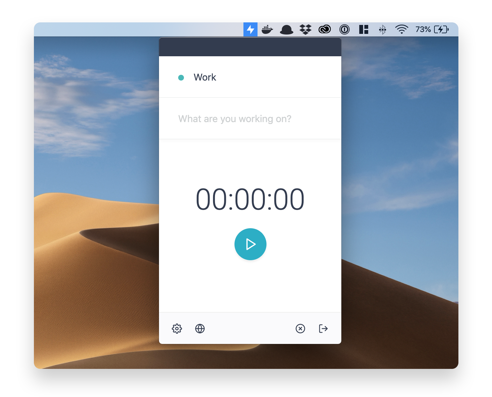

[](https://codeclimate.com/github/hackaru-app/hackaru-desktop/maintainability)
[](https://codeclimate.com/github/hackaru-app/hackaru-desktop/test_coverage)
[](https://opensource.org/licenses/MIT)

<p align="center">
  <p align="center"></p>
  <p align="center">Hackaru for desktop</p>
</p>

## Download

- [MacOS](https://github.com/hackaru-app/hackaru-desktop/releases/download/v1.5.10/hackaru-desktop-v1.5.10.dmg)
- [Windows](https://github.com/hackaru-app/hackaru-desktop/releases/download/v1.5.10/hackaru-desktop-v1.5.10.exe)
- [Linux](https://github.com/hackaru-app/hackaru-desktop/releases/download/v1.5.10/hackaru-desktop-v1.5.10.AppImage)

## Feedback

Do you find a bug or would like to submit feature requests?  
Please let us know via [Issues](https://github.com/hackaru-app/hackaru-desktop/issues). 😉

## Build

To try the desktop app on your local, you need to start the API and web server in advance.  
For information on how to start these servers, see the the [API README](https://github.com/hackaru-app/hackaru-api#quickstart) and [web README](https://github.com/hackaru-app/hackaru-web#quickstart).

```sh
# Move to the api directory you cloned.
cd hackaru-api

# Create an OAuth app on the API server.
docker-compose -f docker-compose.yml -f docker-compose.dev.yml run --rm api bin/rails db:seed

# Clone this repository.
cd ..
git clone git@github.com:hackaru-app/hackaru-desktop.git
cd hackaru-desktop

# Copy and rename env file.
cp .env.sample .env.development

# Install packages and launch the app.
yarn && yarn dev
```

This app is using [atom/node-keytar](https://github.com/atom/node-keytar) to store OAuth tokens.  
You may need to install libsecret if build on Linux. See [detail](https://github.com/atom/node-keytar).

## License

- [MIT](./LICENSE)
